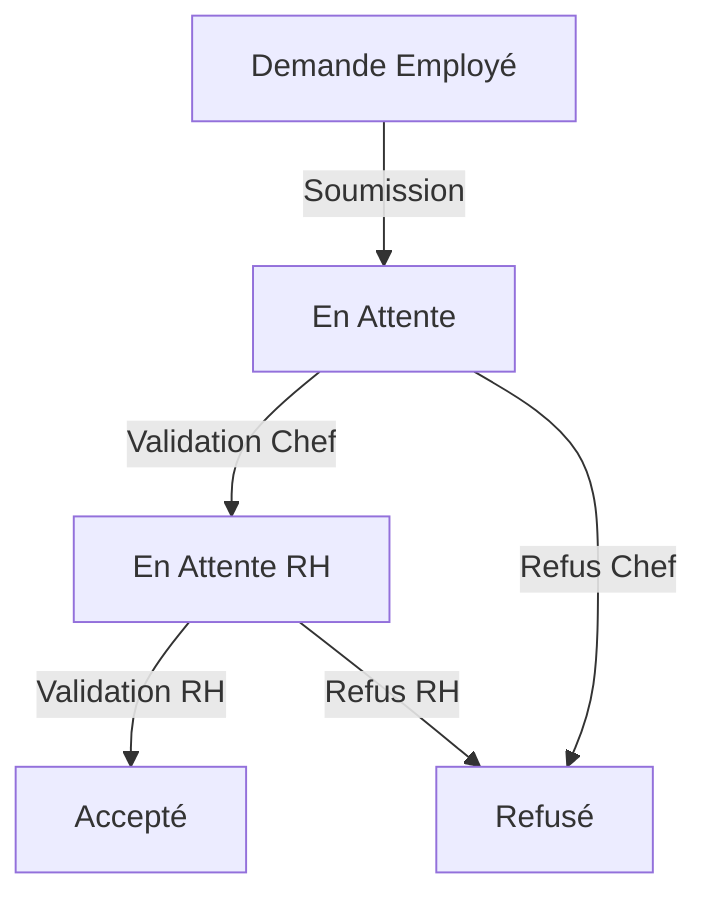

# Dossier de Programmation - Application Jubari

## 1. Introduction

### 1.1 Présentation du Client
**Jubari Consortium** est une entreprise d'ingénierie mécanique spécialisée dans la création de matériels/composants métallurgiques (composants de voitures, rails, avions etc..) pour d'autres particuliers ou entreprises. L'entreprise a démarré ses activités en 2022.

- **Directeur Général** : M. Cerny
- **Prestataire Informatique** : NothingButSkills
  - Équipe basée en île-de-France
  - Plus de dix ans d'expertise
  - Portfolio : Afflelou, CNIT la Défense, FNAC

### 1.2 Objectifs du Projet
Version : 1.0

Développer une application de gestion administrative pour les employés avec :
- Gestion des congés
- Traçabilité des demandes
- Interface utilisateur intuitive
- Workflow de validation automatisé

### 1.3 Contexte et Cahier des Charges
L'application vise à digitaliser et optimiser les processus RH avec une première version focalisée sur la gestion des congés, incluant :
- Demande et suivi des congés
- Validation hiérarchique
- Historique et reporting
- Interface adaptée aux différents rôles

### 1.4 User Stories et Fonctionnalités

#### US1 - Connexion et Authentification
**En tant qu**'utilisateur (employé, chef de service, RH, administrateur),  
**Je veux** pouvoir me connecter avec mes identifiants  
**Afin d**'accéder aux fonctionnalités correspondant à mon rôle.

Implementation :
- Authentification JWT
- Gestion des sessions
- Protection des routes par rôle
- Interface de connexion responsive

#### US2 - Gestion des Rôles et Services
**En tant qu**'administrateur ou RH,  
**Je veux** pouvoir gérer les utilisateurs et leurs rôles  
**Afin de** maintenir une structure organisationnelle efficace.

Implementation :
- Interface de gestion des employés
- Attribution des rôles (Admin, RH, Chef de service, Employé)
- Association employé-service
- Désignation des chefs de service

#### US3 - Gestion des Demandes de Congés
**En tant qu**'employé,  
**Je veux** pouvoir soumettre et gérer mes demandes de congés  
**Afin de** planifier mes absences de manière efficace.

Implementation :
- Formulaire de demande intuitif
- Validation des dates (7 jours minimum)
- Affichage du solde de congés
- Types de congés (payé/non payé)

#### US4 - Validation Multi-niveaux
**En tant que** chef de service ou RH,  
**Je veux** pouvoir traiter les demandes de congés  
**Afin de** maintenir un processus de validation structuré.

Implementation :
- Interface de validation dédiée
- Workflow à deux niveaux (Chef → RH)
- Système de motifs de refus
- Notifications de décision

#### US5 - Historique et Suivi
**En tant qu**'employé,  
**Je veux** pouvoir consulter l'historique de mes congés  
**Afin de** suivre mes demandes et mon solde.

Implementation :
- Vue détaillée des congés
- Filtres par date et statut
- Affichage des décisions
- Export des données

## 2. Structure des Composants

### 2.1 Gestion des Congés
- Composant principal : `GestionCongesPage`
- Fonctionnalités :
  - Affichage des demandes de congés en attente
  - Filtrage et tri des demandes
  - Approbation/refus par le chef de service
  - Approbation/refus par les RH
  - Gestion des statuts : "En attente", "En attente RH", "Accepte", "Refuse"

### 2.2 Historique des Congés 
- Composant principal : `HistoriqueCongesPage`
- Fonctionnalités :
  - Vue d'ensemble des congés de l'employé
  - Filtrage par date et statut
  - Modification des demandes en attente
  - Affichage des motifs de refus

### 2.3 Demande de Congés
- Composant principal : `DemanderCongePage` 
- Fonctionnalités :
  - Formulaire de demande
  - Validation des dates (jours ouvrés)
  - Affichage du solde de congés
  - Délai minimum de 7 jours

## 3. Services et Architecture Technique

### 3.1 Technologies Utilisées
- Frontend : Ionic/Angular
- Backend : API REST
- Base de données : MySQL
- Authentification : JWT

### 3.2 VibraniumService
Gestion des appels API pour les congés :
- Création de congés
- Mise à jour des statuts
- Récupération des historiques
- Gestion des décisions (RH et chefs de service)

### 3.3 AdamantiumService
Gestion des utilisateurs et des services :
- Informations des employés
- Hiérarchie des services
- Rôles et permissions

## 4. Modèles de Données

### 4.1 Congé
```typescript
interface Conge {
  id: number;
  employe: Employe;
  dateDebut: string;
  dateFin: string;
  description: string;
  historiqueConge: Historique;
  paye: number;
  motif_refus?: string;
}
```

### 4.2 Historique
```typescript
interface Historique {
  id: number;
  dateDemande: string;
  dateDecision: string;
  etat: 'En attente' | 'Accepte' | 'Refuse' | 'En attente RH';
}
```

### 4.3 Employé
```typescript
interface Employe {
  id: number;
  email: string;
  nom: string;
  prenom: string;
  role: string;
  service?: Service;
  serviceDirige?: Service;
  nb_conges_payes?: number;
}
```

## 5. Workflow de Validation

1. Soumission de la demande
   - Statut initial : "En attente"
   - Vérification du délai de 7 jours

2. Validation chef de service
   - Si approuvée : passage à "En attente RH"
   - Si refusée : passage à "Refuse" avec motif

3. Validation RH
   - Si approuvée : passage à "Accepte"
   - Si refusée : passage à "Refuse" avec motif

## 6. Sécurité et Permissions

- Administrateur : accès complet
- RH : validation finale des congés
- Chef de service : validation des congés de son service
- Employé : soumission et consultation de ses congés

## 7. Interface Utilisateur

- Design responsive avec Ionic
- Composants réutilisables
- Feedback utilisateur (toasts, alertes)
- Validation des formulaires
- Filtres et recherche

## 8. Conclusion et Perspectives

### 8.1 Réalisations Version 1.0
- Système complet de gestion des congés
- Interface responsive et intuitive
- Workflow de validation multi-niveaux
- Gestion des rôles et permissions

### 8.2 Évolutions Futures
1. Module de pointage
2. Gestion des horaires
3. Tableau de bord analytique
4. Application mobile native
5. Intégration avec d'autres systèmes RH

## 9. Environnement de Développement et Production

### 9.1 Ressources Matérielles

#### Environnement de Développement
**Poste Principal**
- Type : PC Fixe (N102-14)
- OS : Windows 11 64-bit
- Réseau : 172.16.102.14

**Poste Secondaire**
- Type : MacBook Air
- OS : macOS
- Réseau : 172.20.10.2

#### Environnement de Production
- Serveur : siomende.fr
- Protocole : HTTPS
- Hébergement : FTP (FileZilla)

### 9.2 Ressources Logicielles

#### Outils de Développement
- **IDE** : Visual Studio Code
- **Gestion de Projet** : Trello
- **Tests API** : Postman
- **Navigateur** : Google Chrome

#### Stack Technique
- **Frontend** : 
  - Framework : Ionic v7
  - Framework JS : Angular v16
  - Composants UI : Ionic Components
  
- **Backend** : 
  - Framework : CodeIgniter v4
  - ORM : Eloquent
  - Langage : PHP v8.1
  
- **Base de données** : 
  - SGBD : MySQL v8.0
  - Administration : phpMyAdmin
  
- **Sécurité** :
  - Authentification : JWT
  - Transport : HTTPS
  - Validation : API Token

#### Environnement de Test
- Serveur local : XAMPP/MAMP
- Base de données locale
- Tests unitaires : Jasmine/Karma
- Tests E2E : Cypress

## 10. Annexes

### 10.1 Matrice des Rôles et Permissions

| Fonctionnalité | Employé | Chef Service | RH | Admin |
|----------------|---------|--------------|-------|--------|
| Demander congé | ✓ | ✓ | ✓ | ✓ |
| Valider congé | ✗ | Service uniquement | Tous | Tous |
| Gérer employés | ✗ | ✗ | ✓ | ✓ |
| Gérer services | ✗ | ✗ | ✗ | ✓ |
| Voir historique | Personnel | Service | Tous | Tous |

### 10.2 Workflow de Validation des Congés



## 11. Documentation et Présentation

### 11.1 Documentation Technique
La documentation complète du projet est disponible sur GitHub :
- Repository : https://github.com/Saar45/jubari
- Documentation API : https://github.com/Saar45/jubari-api
- Guides d'installation
- Guides de déploiement

### 11.2 Présentation de l'Application

#### Introduction (2-3 minutes)
- Présentation de Jubari Consortium
- Contexte et besoins
- Objectifs du projet

#### Architecture et Technologies (3-4 minutes)
- Stack technique
- Architecture modulaire
- Sécurité et authentification

#### Démonstration (8-10 minutes)
1. **Connexion et Tableau de Bord**
   - Interface de connexion
   - Vue d'ensemble du dashboard
   - Indicateurs clés

2. **Gestion des Congés**
   - Création d'une demande
   - Workflow de validation
   - Notifications et suivi

3. **Administration**
   - Gestion des utilisateurs
   - Configuration des services
   - Reporting

#### Conclusion (2-3 minutes)
- Bénéfices apportés
- Perspectives d'évolution
- Questions/Réponses

### 11.3 Captures d'Écran Principales

#### Interface de Connexion

- Design épuré
- Validation des champs
- Messages d'erreur clairs

#### Tableau de Bord

- Vue synthétique
- Statistiques en temps réel
- Actions rapides

#### Gestion des Congés

- Interface intuitive
- Workflow visuel
- Statuts explicites

### 11.4 Guide Utilisateur Rapide

1. **Connexion**
   - Accéder à https://jubari.siomende.fr
   - Saisir identifiants
   - Choisir "Se souvenir de moi" si souhaité

2. **Demande de Congé**
   - Cliquer sur "Nouveau Congé"
   - Remplir le formulaire
   - Vérifier les dates
   - Soumettre la demande

3. **Suivi des Demandes**
   - Consulter "Mes Congés"
   - Filtrer par statut
   - Voir les détails
   - Modifier si nécessaire

4. **Administration (RH/Chefs)**
   - Accéder à "Gestion Congés"
   - Traiter les demandes
   - Gérer les utilisateurs
   - Consulter les rapports
